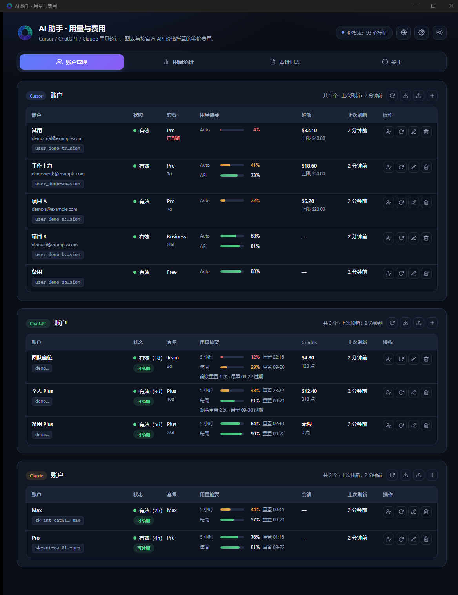
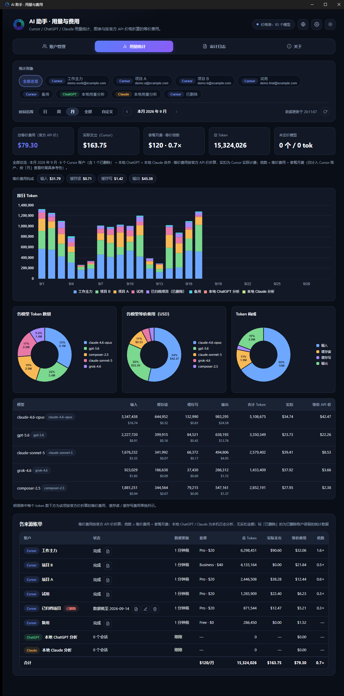
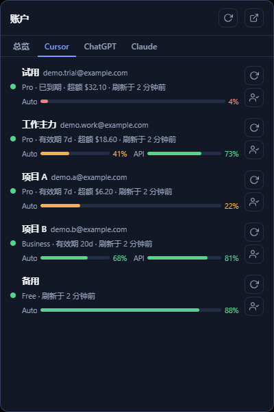

<p align="center">
  
</p>

# my-ai-assistant

**my-ai-assistant** 是一个本地桌面程序，用于管理 Cursor、ChatGPT 与 Claude 账户、查询套餐与额度，
并按模型汇总 token 用量与费用。

程序基于 [Tauri](https://tauri.app/) 2，前端为原生 HTML / CSS / JavaScript，
图表使用 [Chart.js](https://www.chartjs.org/)，网络请求由 Rust 侧 `reqwest` 发出。
当前面向 **Windows** 与 **macOS**。安装包见
[GitHub Releases](https://github.com/bgluminous/my-ai-assistant/releases)
（Windows x64 与 macOS Apple Silicon）；安装包未做代码签名。

HTTP 请求只发往 Cursor / OpenAI / Anthropic 官方域名，以及价格表在线更新与代理测试所用的
`inf.xil.to`。账户凭据保存在本机，不经过第三方服务。

> 用量与账户状态依赖 Cursor、OpenAI、Anthropic 的非公开接口，字段与可用性可能随时变化。
> 使用前请自行核对各服务条款。

## 目录

- [功能](#功能)
- [界面](#界面)
- [运行要求](#运行要求)
- [构建](#构建)
- [配置](#配置)
- [价格表](#价格表)
- [数据来源](#数据来源)
- [仓库布局](#仓库布局)
- [声明](#声明)

## 界面

账户管理、用量总览与托盘账户面板（图中为示例数据）：

<p align="center">
  
</p>
<p align="center">
  
</p>
<p align="center">
  
</p>

## 功能

### 账户管理

- 分别维护 Cursor、ChatGPT 与 Claude 账户：添加、编辑、删除、刷新；可按类型导出/导入 JSON，
  也可从本机已登录客户端导入（仅导入当前类型）。
- 删除 Cursor 账户时可勾选「保留统计数据」（默认勾选）：先做一次最终同步，再把该账户的用量
  事件库连同备注 / 邮箱 / 套餐等展示信息（不含 Token）留在本机，用量统计页总览继续计入并标
  「已删除」；同步失败但本机已有数据时用已有数据保留，本机没有任何数据时会再询问是否仍然删除。
  之后重新添加同一账号（同 user_id）会直接沿用这份数据，不会重复计数。
- Claude 账户支持应用内 OAuth 授权添加：打开浏览器用 claude.ai 账号登录，
  粘贴回调页展示的授权码即可，无需手动找 token。
- 列表展示存活状态、套餐与有效期、额度摘要、按需消费（Cursor）或 Credits（ChatGPT）、
  额度窗口（ChatGPT / Claude 的 5 小时与每周窗口）、ChatGPT 剩余额度重置次数与其中最早一次的
  过期日期（接口提供时显示；托盘副行只显示次数，过期时间在悬停提示里），以及上次刷新时间。
  额度重置时间一律显示具体时刻而非倒计时：不足 24 小时显示时分，否则显示日期，已过则标「已重置」。
  组内按套餐排序：付费套餐按到期时间由近到远（已到期最前），没有到期信息的居中，Free 垫底；
  托盘账户面板的列表与「刷新全部」顺序与此一致。
- 支持按间隔定时刷新（5 / 15 / 30 分钟、1 / 6 / 12 / 24 小时，账户状态与用量统计共用同一间隔），
  也可手动刷新单个或一组账户。
  刷新全部（启动后首轮、定时、托盘「刷新」）按界面显示顺序逐个进行：Cursor 组 → ChatGPT 组 →
  Claude 组，组内按列表顺序。无论从哪个窗口发起刷新，主窗口与托盘面板的行内「刷新中」状态都会同步。
- 可将本机 Cursor / ChatGPT（或 Codex）客户端切换到指定账户并启动；
  Claude 切号写入本机 Claude Code 凭据（Windows 为 `~/.claude/.credentials.json`，
  macOS 为 Keychain），Claude Desktop 仅作客户端联动（运行中先关闭、已安装则完成后启动）。
  客户端路径可手动指定，也可自动搜索常见安装位置。
  切换成功的结果弹窗 3 秒后自动关闭（按钮上倒计时，可手动关闭）；失败结果保留到手动关闭。
- 可退出本机 Cursor / ChatGPT / Claude Code 的登录（各账户分组标题栏的「退出本机登录」按钮）：
  运行中的客户端先关闭，再清除本机登录态——Cursor 清除认证库中的登录键，ChatGPT 删除
  `auth.json` 中的账号凭据（配置了 `OPENAI_API_KEY` 时保留该项），Claude Code 去掉凭据中的
  账号登录段（其它条目保留）；改动前都会备份。只动本机客户端，托管的账户不受影响，
  完成后不自动启动客户端。
- ChatGPT / Claude 账户可保存 `refresh_token`，access token 到期前自动续期。
  ChatGPT 的续期策略与 Codex CLI 一致：access token 距过期不足 5 分钟（或解析不出过期时刻且距
  上次获取超过 8 天）就换新整组凭据，请求返回 401 / 403 时补一次；每次续期都会轮换
  `refresh_token`（它本身不带可读的有效期）。Claude 在 access token 临期或 401 / 403 时续期。
- ChatGPT 账户保存的是本机 Codex 客户端 `auth.json` 的完整副本（含 `id_token`），续期、切换、
  从本机导入都整份写入；手动添加或编辑凭据时会立刻用 `refresh_token` 换取完整一组。
  同步是双向的：程序续期后写回本机 `auth.json`；后台按设置的间隔（默认 5 分钟，可选 1 分钟到
  1 天）检查本机 `auth.json` 的修改时间，ChatGPT Desktop / Codex CLI 自行续期后，同账号账户的副本
  会跟着更新（不联网，与定时刷新无关），刷新和切换前也会再取回一次；续期被拒绝时用本机同一账号的
  凭据重试一次。
  切换账号时，副本完整且 access token 未到续期窗口就直接写入本机，不换票；否则先换票再写入。
  若 `refresh_token` 已失效，结果弹窗提供「强制写入并启动」，直接把保存的副本写入本机。

### 用量统计

- 数据来自已保存的账户，进入页面后自动拉取；结果有短期缓存（与托盘总览共用），可随时手动刷新。
- 统计对象可多选：点击 chip 切换选中 / 取消，「全部总览」即全选（全部取消后自动回到总览）。
  只选一项时进入该项的专属视图（单个 Cursor 账户可生成快照，本地分析可指定目录并重新扫描）；
  选中两项及以上则合并统计，结构与总览相同，「各来源账单」表只列所选来源。
- 时间范围 = 周期 + 滑动：周期为日（默认，今天）/ 周（周一起）/ 月 / 全部，左右箭头前后滑动一个
  周期（不越过今天）；「自定义」可选起止日期查询，也能按区间长度前后平移。
  主窗口关闭到托盘后再打开，范围回到「日 / 今天」。
  不超过两天的区间展示 0–24 时的按小时柱图（含今天时高亮当前小时），其余为按日柱图，
  周 / 月按完整日历区间列轴，横轴统一由旧到新；「今天」与托盘总览共用当日缓存。
- 统一刷新：任意入口（账户页、托盘、定时刷新）刷新账户状态后，自动在后台预取对应来源的用量；
  统计页「刷新」也会顺带刷新相关账户状态。
- 托盘总览复用用量页的共享缓存：按天前后滑动统计日（不越过今天，面板重新打开时回到今天），
  数字与来源饼图取所选日切片，柱状图为该日 24 小时 Token 分布，图表均带图例；
  头部显示数据更新时间（超过缓存有效期标「缓存」），
  统计或刷新账户进行中时显示与主窗口统计页同款的悬浮提示。打开面板、切到总览或切换统计日时，
  数据超过 5 分钟未同步就强制同步一次，不受定时刷新间隔影响。
- 开启定时刷新后，用量统计随同一间隔自动更新。
- **总览**：逐来源列出总 token、实际支出与按官方 API 价折算的等价费用；
  按日 / 按小时 Token 堆叠柱状图（按来源分段），以及各模型 Token 数量、各模型等价费用、
  Token 构成三张环形图与按模型明细表。
- **Cursor 账户的数据源**：每个账户在本机维护一份全量用量事件库（原始事件：模型、四类 token、
  实扣、时间戳），任何时间范围都从事件库切片并按当前价格表折算，切换范围不联网；
  只有刷新才同步——增量同步从库内最后一条事件所在日的 0 点起拉取并替换该日之后的数据，
  统计页「刷新」按钮强制全量重拉。
- **单个 Cursor 账户**：按时间范围切片，按模型聚合输入 / 输出 / 缓存读 / 缓存写 token，
  同时给出实扣金额与等价费用。
- **原始账单**：单账户视图工具栏与「各来源账单」表的行内按钮可打开该账户在当前时间范围内的
  逐笔用量事件（Cursor 上报的原始模型名、四类 token、官方实扣，以及当前价格表下的归一名 / 命中
  价格键 / 等价费用），数据来自本机事件库不联网；支持按模型名筛选、导出 CSV（UTF-8 BOM）。
  已删除账户保留的数据同样可查看。
- **清除本地数据**：原始账单弹窗与「编辑账户」弹窗（Cursor 账户）提供「清除本地数据」，删除该
  账户在本机的事件库与统计缓存，账户与 Token 保留，下次刷新用量时重新全量拉取。
- **已删除账户**：删除时选择保留的统计数据在总览表中作为独立行（标「已删除」）计入合计与合并
  图表，只在所选跨度内有用量时出现；行内「编辑备注」可改显示名（留空恢复自动备注，按邮箱 /
  账号 ID 兜底），「修改套餐」可从固定档位中指定套餐（删除时会话已失效、没记下套餐的在此补填；
  在用账户的套餐来自接口不可手改），「删除统计数据」可彻底清理。有保留数据时「统计对象」末尾
  多一个「已删除」选项，作为一个整体参与多选，单选即全部已删除账户的合并用量与逐账户账单。
  托盘总览同样计入。
- **本机 ChatGPT 会话**：扫描 Codex CLI 会话日志（默认 `~/.codex/sessions`），按模型聚合 token
  并折算等价费用。解析按文件修改时间增量进行。同一会话谱系内按累计用量计数器去重：
  额度刷新 / 恢复会话时重复上报的用量，以及分叉 / 子 Agent 日志开头复制的父任务历史都只计一次，
  时间以父任务原始记录为准。
- **本机 Claude Code 会话**：扫描 Claude Code 会话日志（默认 `~/.claude/projects`，
  支持 `CLAUDE_CONFIG_DIR` 多目录），按模型聚合 token 并折算等价费用；
  按 message id + request id + 会话去重，流式重复与 sidechain 重放不重复计数。

### 其它

- **审计日志**：记录账户增删改、导入导出、存活状态变化、刷新失败、
  ChatGPT / Claude 续期与本机登录同步、切换本机登录、用量快照、原始账单导出、已删除账户统计数据的
  删除与沿用、清除账户本地用量数据、定时间隔变更、开机启动开关、价格表在线更新、全量备份导入导出等。
  每条记录带级别（信息 / 警告 / 错误）与分类（账户管理 / 状态与刷新 / 凭据与同步 / 用量数据 /
  设置与系统），页面可按级别与分类筛选或清空；本机 ChatGPT 登录文件每次检测到变化都会记一条
  同步结果（同步了几个账户，或未同步的原因）。日志为 JSON Lines，超限后轮转并保留最近约 2000 条。
- **系统托盘**：关闭主窗口时转入托盘，定时刷新继续运行。左键单击打开账户面板，双击打开主窗口；
  面板失焦或再次单击后隐藏。托盘菜单提供显示主窗口与退出；只有「退出」结束进程。
  主窗口隐藏或最小化后再打开，回到本次启动首次显示的位置。
- **开机启动**：设置中可开启开机自启动（Windows 注册表 Run 项 / macOS LaunchAgent），
  可选「静默启动」——开机拉起时不弹主窗口，仅托盘运行。
- **数据备份**：设置中可把全部数据（所有设置、账号含 Token、界面偏好、已删除 Cursor 账户保留的
  统计数据）导出为单个 JSON 文件，支持可选密码加密（PBKDF2-SHA256 + AES-256-GCM）；
  导入为合并模式——账号按身份去重后合并，已删除账户的统计数据按身份合并（本机同身份账号仍在用
  则跳过，已有保留记录取较新的一份），其余设置以备份文件为准，导入后立即生效无需重启。
  在用账户的事件库不随备份携带，导入后刷新即可重新同步。
- **显示**：深色 / 浅色主题；token 数量可在完整数字、K·M·B、万·亿之间切换。
- **网络代理**：系统代理、直连或自定义 HTTP / SOCKS 代理，保存后立即生效。
- **单实例**：重复启动只唤出已有主窗口，避免并发读写配置文件。

## 运行要求

- [Node.js](https://nodejs.org/) 18 或更高（用于 `@tauri-apps/cli`）。
- [Rust](https://rustup.rs/) 工具链（`rustup`）。
- 平台链接器：
  - **Windows**：Visual Studio Build Tools，勾选「使用 C++ 的桌面开发」（MSVC 与 Windows SDK）。
  - **macOS**：`xcode-select --install`。
- **Windows** 需要 [WebView2](https://developer.microsoft.com/microsoft-edge/webview2/) 运行时。
  Windows 11 通常已预装。

## 构建

```bash
npm install
npm run tauri dev      # 开发运行
npm run tauri build    # 打包当前平台安装包
```

## 配置

用户数据目录：

| 平台         | 路径                                   |
|--------------|----------------------------------------|
| Windows      | `%USERPROFILE%\.xilore\myaiassistant\` |
| macOS / 其它 | `~/.xilore/myaiassistant/`             |

旧版本使用不带点号的 `xilore/myaiassistant/`。启动时若旧目录存在而新目录不存在，
会自动把旧目录整体移动到新位置；两者都存在时以新目录为准、旧目录不动。

| 文件                          | 内容                                                                                                               |
|-------------------------------|--------------------------------------------------------------------------------------------------------------------|
| `settings.json`               | 账户、刷新间隔、代理、价格覆盖、Cursor / ChatGPT / Claude Desktop 客户端路径、静默启动偏好                         |
| `audit.jsonl`                 | 审计日志                                                                                                           |
| `usage-archive/<账户id>.json` | Cursor 账户的用量事件库（原始事件 + 同步时间；已删除账户的还带备注 / 邮箱 / 套餐等展示信息与删除时间，不含 Token） |

应用内可复制上述路径。

`settings.json` 以临时文件写入后原子替换。启动时若读取失败（例如文件被短暂占用）会重试，
不会用空数据覆盖原文件；JSON 解析失败时先备份为 `settings.json.bad`。

**凭据存放在本机。** Cursor / Claude 的 token 为明文；ChatGPT 账户只保存加密的 `auth.json`
副本（AES-256-GCM，密钥内置于程序，只能防止被直接读出，不能防御反编译），token 在运行时由副本
解出，旧版本的明文凭据会在首次启动时自动迁移。不要把该目录提交到版本库，也不要分享
`settings.json`。审计日志只记录备注或打码后的 token，不含完整凭据。

主题与 token 显示单位保存在 WebView 的 `localStorage` 中，不进入 `settings.json`；
全量备份导出时会把这两项界面偏好一并写入备份文件。
开机自启动开关本身注册在系统（Windows 注册表 / macOS LaunchAgent），不随备份迁移。

## 价格表

- 内置默认表：`src-tauri/resources/pricing.default.json`。
- 单价单位为美元 / 每百万 token，字段为 `input`、`output`、`cacheRead`、`cacheWrite`。
- 用户改价只把与默认不同的条目写入 `settings.json` 的 `pricing` 字段；
  未改动的模型仍随内置表更新。重置覆盖不会删除整个设置文件。
- 表中没有的模型标记为「未定价」。
- 等价费用的口径是**模型厂商的官方 API 价目**（OpenAI、Anthropic、Google、xAI 等），不是 Cursor 等
  分发方的售价；Cursor 的账单只用来核对上报的模型名能否命中。只在 Cursor 提供的模型（Composer）
  以 Cursor 官方价目为厂商价。
- Fast 条目只收录厂商官方设有 Fast 档的模型（OpenAI Fast mode、Anthropic fast mode 的
  Opus 5.5 / 5 / 4.8、Cursor Composer 2.5 Fast），键为「基础模型键 + `-fast`」（如 `gpt-5-fast`、
  `claude-opus-5-fast`），上报名末尾的 `-fast` 会归到对应条目。厂商没有 Fast 档的模型
  （如 xAI Grok，Cursor 对其 Fast 的加价属 Cursor 自身定价），其 Fast 用量独立成行、按标准价折算并在
  价格标签里显示套用的基础键。
  Max 是 effort 等级而非计费档，按基础模型计价。
- 默认价格为折算参考，使用前请对照 Anthropic、OpenAI、Google、xAI、Cursor 等厂商的现行价目。
  部分厂商对超长上下文的加价规则未写入默认表。
- 内置表随程序一起编译进二进制，新增或修改默认条目后需要重新构建才会生效；
  已安装的旧版本可通过应用内「在线更新」拉取远端表，或直接在价格表页手动增改。

## 数据来源

| 来源     | 鉴权                                                                              | 用途                                                                                                         |
|----------|-----------------------------------------------------------------------------------|--------------------------------------------------------------------------------------------------------------|
| Cursor   | `WorkosCursorSessionToken`（支持 `user_xxx::<jwt>`，`%3A%3A` 会归一为 `::`）      | 用量摘要、计费周期、按事件聚合、Grok 周额度、账户邮箱、本机会话切换                                          |
| ChatGPT  | `Authorization: Bearer` + `ChatGPT-Account-Id`                                    | 额度窗口、订阅信息；续期走 OAuth `refresh_token`                                                             |
| Claude   | `Authorization: Bearer`（OAuth access token）+ `anthropic-beta: oauth-2025-04-20` | 额度窗口（5 小时 / 每周）、账户邮箱与组织；授权与续期走 Claude Code 同款 OAuth（PKCE）                       |
| 本机会话 | 无网络                                                                            | 读取 Codex CLI 的 `sessions/**/*.jsonl` 与 Claude Code 的 `projects/**/*.jsonl`，按轮次 token 与模型归属聚合 |

Cursor 套餐有效期取自当期计费周期起止；到期后由官方侧续期并重置额度。
ChatGPT 套餐有效期来自订阅接口（JWT 通常不含该字段）。
Claude 接口不提供订阅起止，仅展示额度窗口与重置时间。

## 仓库布局

```
my-ai-assistant/
├── LICENSE                   # GNU GPLv3
├── package.json              # npm 脚本与 @tauri-apps/cli、chart.js
├── app-icon.png              # 图标源图（AI 生成，四角透明；`npm run icons` 由它生成各平台图标）
├── docs/screenshots/         # README 界面示例图
├── scripts/                  # JS 语法检查、Windows 本地打包
├── src/                      # 前端（Tauri frontendDist）
│   ├── index.html            # 主窗口
│   ├── tray.html             # 托盘面板
│   └── vendor/               # Chart.js UMD
└── src-tauri/                # Rust 后端
    ├── Cargo.toml
    ├── tauri.conf.json
    ├── capabilities/
    ├── resources/pricing.default.json
    └── src/                  # 账户、用量、审计、托盘、代理、价格、本机客户端
        └── tests/            # 各模块的单元测试，文件名与被测源文件同名（源文件末尾以 #[path] 挂载）
```

## 声明

本程序采用 [GNU GPLv3](https://www.gnu.org/licenses/gpl-3.0.html)。
可以复制、修改和再分发（含商用）；再分发时必须保留版权声明、提供对应源码，
并以 GPLv3 授权。参考或衍生请写明作者 BGLuminous
与项目出处（https://github.com/bgluminous/my-ai-assistant）。
完整条款见 [LICENSE](LICENSE)。

本程序调用 Cursor、OpenAI 与 Anthropic 的非公开接口，仅供在本机查询自己的账户与用量。
接口变更、账号限制或服务条款冲突导致的任何后果由使用者自行承担。
本仓库与 Cursor、OpenAI、Anthropic、Google、xAI 无附属关系。
